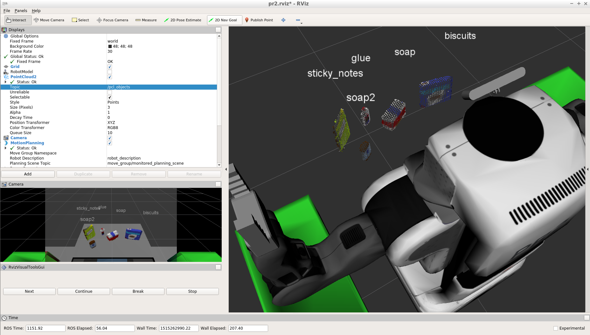

# Udacity RSEND Perception Project Writeup

**Author:** Ivo Georgiev

**Date:** Jan 3, 2018

## Table of Contents
* [Overview](#overview)
* [Perception pipeline](#perception-pipeline)
  * [SVM model](#svm-model)
    * [Parameters](#parameters)
    * [Training](#training)
    * [Performance](#performance)
      * [Figure 1](#figure-1)
      * [Figure 2](#figure-2)
      * [Figure 3](#figure-3)
      * [Figure 4](#figure-4)
      * [Figure 5](#figure-5)
* [Pick\-n\-place requests](#pick-n-place-requests)
  * [Files](#files)
* [Implementation details](#implementation-details)
  * [Dropbox class](#dropbox-class)
* [Future work](#future-work)
  * [Improvements](#improvements)
  * [Extensions](#extensions)


## Overview

This project involves object recognition for robot pick-and-place in Gazebo/RViz. A Willow Garage [PR2](http://www.willowgarage.com/pages/pr2/overview) robot is standing in front of a table on which various objects are placed. On both sides of the robot there are tables with a colored dropbox on each. The pick-and-place operation involves identifying the objects on the front table, picking them and placing them each in the appropriate box. Three different scenes, with 3, 5, and 8 objects, respectively, are presented to the robot.

This submission contains only the _object recognition, labeling, and pick-and-place message formation_.

## Perception pipeline

The perception input are _ROS point clouds_. The PLC library is used for filtering, so the ROS point cloud is converted back and forth to PLC point cloud. Full RGB/HSV+XYZ data is used for the pipeline.

The following perception pipeline, including the code from exercises 1-3, is implemented in the `pcl_callback()` routine of the [percpetion.py](perception.py) file, in order, starting on Line 66:
1. Voxel grid downsampling.
2. Denoising using a _statistical outlier filter_. _Note: Denoising is important to reduce the false positive object recognitions. The parameters were chosen based on the reasnoning that with the object clouds being dense but noise being sparse and random, points in dense object clouds will have mean neighborhood distances very close to the global mean but noise points would have larger neighboring distance and can be filtered out almost completely. Indeed, this was the case._
3. Two _pass-through_ filters to limit the perceived space along the `z` and `y` axes. _Note: The `z`-plane range filters out everything but the table and objects in front of the robot. The `y`-plane range filters the tables and boxes on both sides of the robot._
4. _RANSAC_ segmentation with a _plane model_ is used to remove the table from the point cloud.
5. Another _statistical outlier filter_ for the tabletop objects point cloud. _Note: This one is largely unnecessary, but empirically recognition has been better with it included._
6. _Euclidean clustering_ is performed on the tabletop objects point cloud and the sub-cloud for each object is colored in a different color.
7. A _pretrained SVM model_ is used to recognize each detected object and insert a label above it in the world scene.

### SVM model

A support-vector-machine (SVM) model was used to train on the _object features_ to recognize the objects from their _point clouds_.

#### Parameters

A _linear_ SVM model with small _misclassification penalty scale factor C (0.05)_ (for prefering wider support-vector margins) and _balanced class weights_ (largely unnecessary because all objects come with an equal number of samples) does reasonably well when trained with **30** samples per object. It's overall accuracy is **~92%**. 

_Note: While initially a different set of features was collected and a different model was trained separately for each scene, the final results are all from the model for Scene 3, which contains all objects._

#### Training

The features are a concatenation of the HSV and normal histograms of an object, extracted from its point cloud. The [features.py](features.py) file implements the two relevant functions `compute_color_histograms(cloud, using_hsv=False)` and `compute_normal_histograms(normal_cloud)`. The confusion matrices are shown below.


#### Performance

The model consistently (within a small error margin) recognizes and correctly labels:
1. 3/3 objects in scene 1.
2. 5/5 objects in scene 2.
3. 7/8 objects in scene 3.

_Note: The feature training and model files have been included for each scene._

RViz views of the perception pipeline are shown below.

##### Figure 1


##### Figure 2 


##### Figure 3

_Note: The Snacks object is misclassified as Glue._


##### Figure 4



##### Figure 5


## Pick-n-place requests

Request messages for the pick-n-place service are properly formatted and written to YAML files, separately for each scene, in the `pr2_mover()` routine of the [percpetion.py](perception.py) file. The following is the output YAML file for scene 1. _Note: Orientation quaternions have not been filled._

```yaml
object_list:
- arm_name: right
  object_name: biscuits
  pick_pose:
    orientation:
      w: 0
      x: 0
      y: 0
      z: 0
    position:
      x: 0.5419755578041077
      y: -0.24277746677398682
      z: 0.7059687972068787
  place_pose:
    orientation:
      w: 0
      x: 0
      y: 0
      z: 0
    position:
      x: 0
      y: -0.71
      z: 0.605
  test_scene_num: 1
- arm_name: right
  object_name: soap
  pick_pose:
    orientation:
      w: 0
      x: 0
      y: 0
      z: 0
    position:
      x: 0.5421528816223145
      y: -0.019842833280563354
      z: 0.6743276119232178
  place_pose:
    orientation:
      w: 0
      x: 0
      y: 0
      z: 0
    position:
      x: 0
      y: -0.71
      z: 0.605
  test_scene_num: 1
- arm_name: left
  object_name: soap2
  pick_pose:
    orientation:
      w: 0
      x: 0
      y: 0
      z: 0
    position:
      x: 0.44561120867729187
      y: 0.22260966897010803
      z: 0.6778631806373596
  place_pose:
    orientation:
      w: 0
      x: 0
      y: 0
      z: 0
    position:
      x: 0
      y: 0.71
      z: 0.605
  test_scene_num: 1
```

### Files

All required files are in the [submission](https://github.com/ivogeorg/udcty-rsend-perception-project/tree/master/submission) directory of the repository.

YAML files: [Scene 1](output_1.yaml) | [Scene 2](output_2.yaml) | [Scene 3](output_3.yaml)

## Implementation details

### Dropbox class

The `Dropbox` class was used to clean up the parameter reading and streamline the request message construction.

1. Declaration:
  ```python
  class Dropbox:
      def __init__(self, color, arm, x, y, z):
          self.color = color
          self.arm = arm
          self.position = []
          self.position.append(x)
          self.position.append(y)
          self.position.append(z)
   ```
2. Reading parameters:
    ```python
    object_list_param = rospy.get_param('/object_list')
    dropbox_list_param = rospy.get_param('/dropbox')
    boxes = {}
    for box in dropbox_list_param:
        boxes[box['group']] = Dropbox(box['group'], box['name'], box['position'][0], box['position'][1], box['position'][2]) 
    boxes['unknown'] = Dropbox('unknown', 'unknown', 0, 0, 0)
    ```
3. Constructing request messages:
    ```python
                # set arm_name
                arm_name = String()
                arm_name.data = boxes.get(pick_object_group, 'unknown').arm

                # set place_pose
                place_pose = Pose()
                dropbox = boxes.get(pick_object_group, 'unknown')
                place_pose.position.x = dropbox.position[0]
                place_pose.position.y = dropbox.position[1]
                place_pose.position.z = dropbox.position[2]
    ```

## Future work

### Improvements

1. The routine `pcl_callback()` is unwieldy and hard to maintain. I would pull out some of the code into separate routines and pull up the parameters for easy experimentation.
2. I believe there is still some fine-tuning of the parameters left to be done. After (1), this process would be easier.
3. I would like to visualize, to the extent possible, the feature space for this project, and come up with a model that recognizes all objects. I would parametrize the locations of the objects so I can generate my own scenarios with a routine.
4. _Faster computer! Darn it, a Macbook Pro running Yosemite and the RoboND VM in Virtual Box is no fun. Gotta a have the right tools to do good work fast._

### Extensions

1. I would like to complete the pick-and-place routine, including collision avoidance and robot motion, and have the robot place the objects in the dropboxes.
2. Finally, I would like to tackle the cluttered scene with the double-decker tables.
